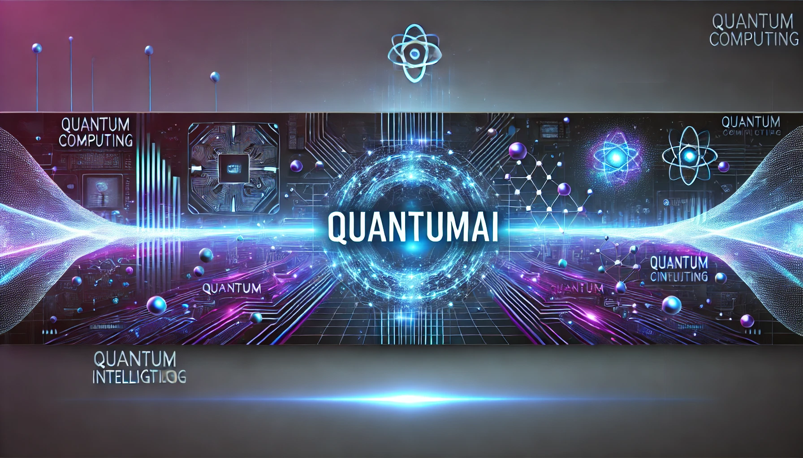

# QuantumAI 🧠⚛️  
> **The Future of AI is Quantum** — A cutting-edge framework combining **Quantum Computing** and **Artificial Intelligence** for unparalleled computational power.  

<div align="center">

  

[](LICENSE.md)  
[](#prerequisites)  
[](#status)  
[](#contributing)  

</div>

---

## 🚀 About QuantumAI  
QuantumAI is a **proprietary AI-Quantum computing framework** that enhances **machine learning algorithms with quantum-powered optimizations**. This project is **designed for serious researchers, AI engineers, and enterprises** seeking to leverage **quantum-enhanced AI models**.  

**🔒 Commercial usage requires a paid license.** See **[LICENSE.md](LICENSE.md)** for terms.  

---

## ✨ Key Features  

✅ **Quantum-enhanced neural networks** – Unlock AI capabilities beyond classical computing.  
✅ **Hybrid Classical-Quantum Optimization** – Combines classical deep learning with quantum optimization.  
✅ **Quantum Feature Mapping** – Transform classical data into quantum states for superior efficiency.  
✅ **Multi-Quantum Hardware Support** – Compatible with **IBM Q, Rigetti, Google Quantum AI, IonQ,** and more.  
✅ **FastAPI-Powered API** – Expose quantum models via RESTful API & WebSockets.  
✅ **Built-in Quantum ML Benchmarking** – Evaluate classical vs. quantum performance.  

---

## 🛠️ Prerequisites  

To run QuantumAI, ensure you have the following:  

### **Required**  
🔹 Python **3.9+**  
🔹 **Poetry** (Dependency manager)  
🔹 **gcc/g++** (For compiling core components)  

### **Optional (For CUDA Acceleration)**  
🔹 **NVIDIA CUDA** – For faster deep learning computations  
🔹 **cuQuantum SDK** – Optimized quantum circuit simulations  

### **Important Version Constraints**  
- `numpy == 1.23.5`  
- `pennylane == 0.31.0`  

---

## 🔧 Installation  

### **1️⃣ Install System Dependencies** (Ubuntu/Debian)  

```bash
sudo apt-get update
sudo apt-get install python3-dev build-essential gcc g++
```

### **2️⃣ Install QuantumAI with Poetry**  

```bash
poetry config virtualenvs.in-project true
poetry install --no-cache
```

#### **🛠️ Troubleshooting: NumPy Issues?**  

```bash
poetry run pip install --no-cache-dir numpy==1.23.5
poetry install
```

---

## 🚀 Usage  

### **Start the API Server**  

```bash
poetry run uvicorn quantum_ai.api.main:app --reload
```

### **Run Quantum Workloads**  

```python
from quantum_ai.circuits import QuantumCircuit
qc = QuantumCircuit()
qc.run()
```

---

## 🧪 Testing  

Run the test suite:  

```bash
poetry run pytest
```

---

## 🏗️ Architecture  

QuantumAI follows a **modular architecture**, ensuring extensibility and seamless integration of **quantum and classical AI models**.  

📂 **`quantum_ai/circuits/`**  
  - Gate-based **quantum circuits**  
  - Variational **quantum algorithms**  

📂 **`quantum_ai/api/`**  
  - **FastAPI**-based REST API  
  - WebSocket support for **real-time quantum inference**  

📂 **`quantum_ai/embeddings/`**  
  - **Quantum Feature Mapping**  
  - Hybrid **classical-quantum embeddings**  

📂 **`quantum_ai/training/`**  
  - **Quantum-enhanced neural networks**  
  - **Hybrid QML optimizers**  

---

## 🔥 Roadmap  

🚀 **Q1 2025:** **Quantum GANs** – Generative adversarial networks powered by quantum sampling.  
🚀 **Q2 2025:** **Quantum NLP** – Explore quantum-enhanced **natural language processing**.  
🚀 **Q3 2025:** **Federated Quantum Learning** – Secure, decentralized AI training.  

[📜 Full Roadmap](docs/roadmap.md)  

---

## 🤝 Contributing  

🔹 **Fork the Repository**  
🔹 **Create a Feature Branch**  
🔹 **Run Tests Before Submitting PRs**  
🔹 **Submit a Pull Request with Detailed Notes**  

---

## 📜 Documentation  

📘 **API Docs:** `http://localhost:8000/docs`  
📘 **[Architecture Overview](docs/architecture.md)**  
📘 **[Development Guide](docs/development.md)**  

---

## 🔒 License  

QuantumAI is licensed under the **QuantumAI Proprietary License (QPL v1.1)**.  

⚠️ **This software is NOT open-source**. Commercial use requires a **paid license**.  

📜 **Read Full Terms:** [LICENSE.md](LICENSE.md)  

---

## 🚀 Support & Contact  

📧 **Email:** quantascriptor@gmail.com  
🌎 **Website:** [quantum.api](https://quantum.api)    

---

# QuantumAI Chat Interface

A next-generation chat interface with quantum computing capabilities.

## Features

- 🚀 Real-time quantum-enhanced chat responses
- ✨ Animated message transitions
- 📝 Markdown support in messages
- 🎵 Sound effects for interactions
- 👍 Message reactions
- ⌨️ Typing indicators
- 📱 Responsive design
- 🎨 Dark mode interface

## Setup

1. Install dependencies:
```bash
npm install
# or
yarn install
```

2. Install required packages:
```bash
npm install framer-motion react-markdown react-icons use-sound axios
```

3. Add sound effects:
- Create a `public` folder in your project root
- Add `message-sound.mp3` to the `public` folder

4. Start the development server:
```bash
npm run dev
# or
yarn dev
```

## Environment Variables

Create a `.env` file in the root directory:

```env
REACT_APP_API_URL=your_api_url
```

## Tech Stack

- React with TypeScript
- Framer Motion for animations
- React Markdown for message formatting
- Use-Sound for audio effects
- Axios for API calls

## Contributing

1. Fork the repository
2. Create your feature branch (`git checkout -b feature/amazing-feature`)
3. Commit your changes (`git commit -m 'Add some amazing feature'`)
4. Push to the branch (`git push origin feature/amazing-feature`)
5. Open a Pull Request

---

# QuantumAI License Management System

A blockchain-based licensing system for AI model access control and monetization.

## Overview

The QuantumAI License Management System provides:
- Time-based access control for AI models
- Automated license validation and enforcement
- Usage-based billing and royalty collection
- Programmatic access revocation
- Transparent transaction history

## Technical Architecture

### Smart Contract Components

1. **License Token (ERC-1155)**
   - Represents active license ownership
   - Includes metadata about license terms
   - Non-transferable implementation

2. **Revenue Sharing (ERC-2981)**
   - Automated royalty distribution
   - Configurable revenue split
   - Per-transaction enforcement

3. **Access Control**
   - Time-based validation
   - Grace period handling
   - Blacklist functionality

## Implementation Guide

### Contract Deployment

```javascript
const contract = await QuantumAILicense.deploy(
  licenseFee,    // Base fee in wei
  royaltyRate    // Percentage (1-100)
);
```

### License Management

```javascript
// Purchase license
await contract.purchaseLicense(duration, { value: fee });

// Validate license
const isValid = await contract.hasValidLicense(address);

// Revoke access
await contract.revokeLicense(address);
```

### API Integration

```python
from web3 import Web3
from quantum_ai.licensing import LicenseValidator

def verify_access(user_address: str) -> bool:
    return await LicenseValidator.check_license(user_address)
```

## Security Considerations

- Immutable license records
- Cryptographic access verification
- Automated compliance enforcement
- Transparent audit trail

## Technical Documentation

- [Smart Contract Reference](docs/contract-reference.md)
- [API Integration Guide](docs/api-integration.md)
- [Security Model](docs/security.md)

## License

Commercial use requires a valid on-chain license. See [LICENSE.md](LICENSE.md).
